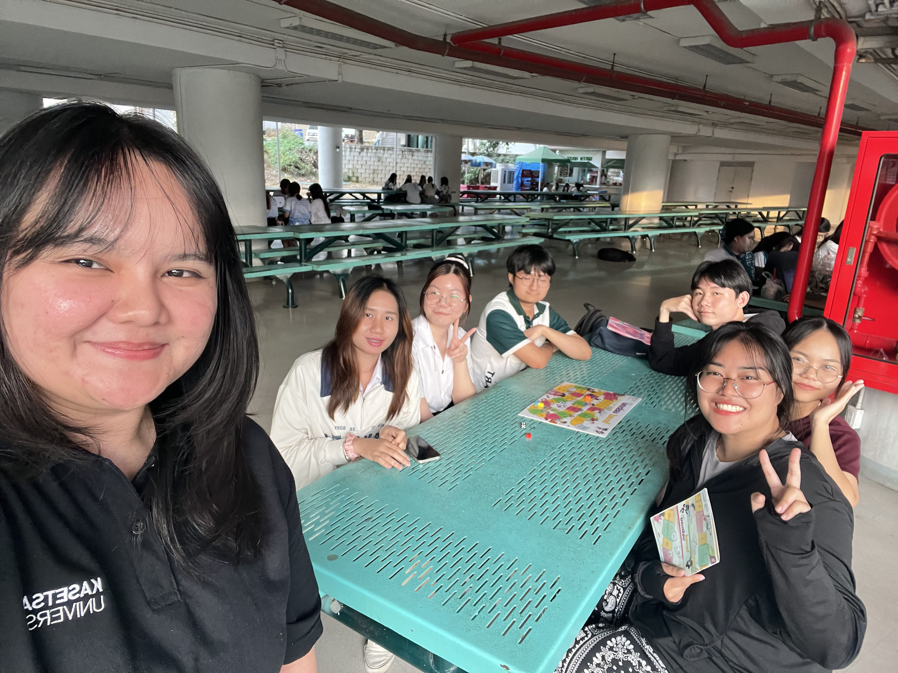
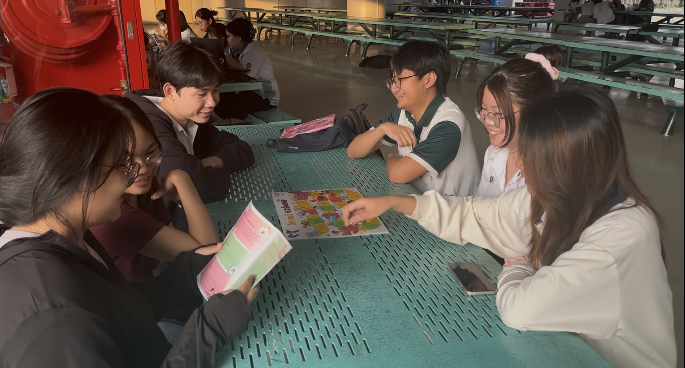

<body>
  <h1>🎮 NCSA Boardgame Activity with Manoi Group</h1>
  <h2>🔐 Securing Human in Information System Security Class</h2>
   
  <h2>รายละเอียดกิจกรรม 📋</h2>
  <h3>กลุ่มนิสิตจากสาขาวิชาวิทยาการคอมพิวเตอร์ภายใต้ชื่อ “Manoi” ได้จัดกิจกรรมเพื่อสร้างความตระหนักรู้บนโลกไซเบอร์เมื่อวันที่ 24 มกราคม 2568 เวลา 17:00น.
ณ ตึก 17 มหาวิทยาลัยเกษตรศาสตร์ วิทยาเขตศรีราชา ให้กับนิสิตคณะวิทยาการจัดการ สาขาการบัญชี</h3>
  <h4>กิจกรรมนี้ใช้บอร์ดเกมที่พัฒนาโดย สำนักงานคณะกรรมการการรักษาความมั่นคงปลอดภัยไซเบอร์แห่งชาติ (สกมช.) หรือ NCSA
</h4>
</body>

# มีผู้เข้าร่วมกิจกรรมจำนวนทั้งหมด 7 คน
- นิสิตสาขาการบัญชี 2 คน
- สมาชิกกลุ่มผู้จัดทำ 4 คน
- ตัวแทนถ่ายวีดีโอกิจกรรม 1 คน

# รูปภาพกิจกรรม 📷

# VDO บรรยากาศกิจกรรม

> ทั้งนี้ทางกลุ่มผู้จัดได้ขออนุญาตผู้เข้าร่วมถ่ายภาพและวิดีโอเพื่อบันทึกภาพกิจกรรมดังกล่าวเรียบร้อยแล้ว

# สิ่งที่ได้รับจากกิจกรรม
- สามารถเข้าใจถึง ความเสี่ยงและการป้องกันภัยในโลกไซเบอร์ได้ดียิ่งขึ้น
- กิจกรรมยังช่วยส่งเสริมให้เกิด พฤติกรรมที่ปลอดภัยในสังคมดิจิทัลได้อย่างมีประสิทธิภาพ
